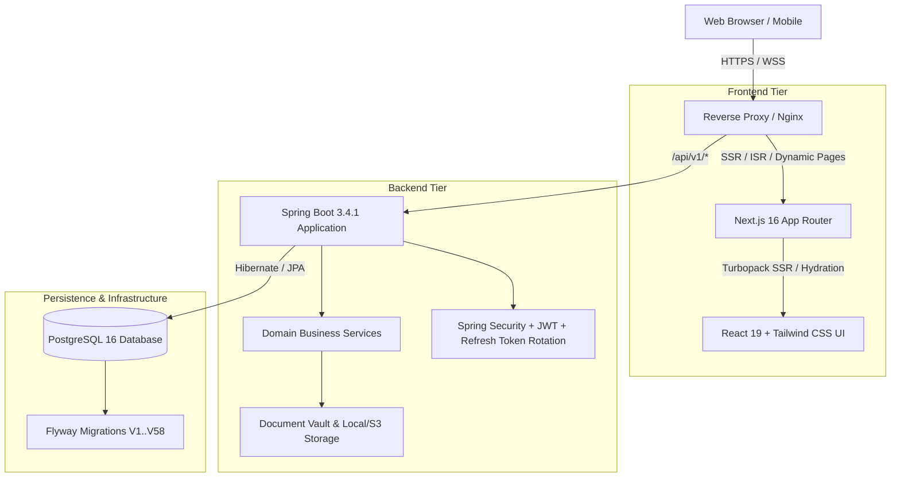

<div align="center">

# 🧪 KemKendra

### Enterprise B2B Chemical & Pharmaceutical Procurement Marketplace

[](https://spring.io/projects/spring-boot)
[](https://nextjs.org/)
[](https://www.typescriptlang.org/)
[](https://www.oracle.com/java/)
[](https://www.postgresql.org/)
[](https://www.docker.com/)
[](LICENSE)

<p align="center">
  A high-performance, enterprise-grade B2B marketplace engineered for verified chemical manufacturers, bulk pharmaceutical ingredient suppliers, and global commercial buyers.
</p>

[Explore Catalog](https://kemkendra.online/products) • [Supplier Directory](https://kemkendra.online/suppliers) • [API Documentation](#-api-architecture) • [Deployment](#-deployment-guide)

</div>

---

## 📌 Overview

**KemKendra** digitizes and streamlines complex chemical and pharmaceutical supply chains. Unlike generic marketplaces, KemKendra addresses the rigorous regulatory, compliance, and logistical complexities inherent to bulk chemical trade:

* **Canonical Master Catalog**: Centralized database of verified chemicals with standardized CAS numbers, molecular formulas, purity standards, and official certifications.
* **Supplier Offerings & Commercial Transparency**: Multiple verified manufacturers attach distinct commercial offerings (MOQ, lead times, purity grades, packaging specs, and tiered pricing) to a single master chemical.
* **Intelligent RFQ & Counter-Offer Engine**: Multi-supplier Request for Quote workflows with negotiation state machines, revision tracking, and automated quote expirations.
* **End-to-End Procurement Lifecycle**: Seamless transition from RFQ acceptance to Purchase Orders (PO), pro-forma invoices, milestone tracking, and delivery validation.
* **Audit & Dispute Governance**: Comprehensive immutable audit logs, dispute filing with encrypted document vaults, and escrow/payment milestone safety.

---

## 🏛 Architecture Overview

KemKendra employs a decoupled, cloud-native architecture optimized for sub-second page loads, strict type safety, and institutional-grade data integrity.



---

## ✨ Key Platform Features

### 🔬 1. Canonical Master Catalog
* Authoritative chemical records cataloging chemical synonyms, molecular weight, formula, and CAS registries.
* High-resolution asset management for compound structures and packaging specifications.
* Multi-field full-text search with phonetic and fuzzy matching across categories (APIs, Agrochemicals, Solvents, Fine Chemicals, Excipients).

### 🤝 2. Multi-Supplier Commercial Marketplace
* Verified manufacturers publish independently managed offerings mapped to canonical master products.
* Transparent visibility into minimum order quantities (MOQ in kg/MT), lead times, packaging variants (drums, ISO tanks, IBCs), and Incoterms (FOB, CIF, EXW).
* Manufacturer verification badges based on audited certifications (WHO-GMP, ISO 9001/14001, FDA, REACH).

### 📑 3. RFQ Negotiation & Purchase Orders
* Structured quotation workflows allowing buyers to submit custom specifications (assay percentage, impurity limits, COA requirements).
* Counter-offer negotiation state machines with real-time email dispatch and dashboard alerts.
* Instant generation of Purchase Orders upon RFQ award with verifiable contractual audit trails.

### 🛡 4. Enterprise Security & Hardening
* **Zero Trust Token Authentication**: Ephemeral JWT access tokens paired with cryptographically secure, rotating HttpOnly refresh cookies.
* **Anti-Hijacking Email Verification**: Email verification validates address ownership without leaking session bearer tokens, completely preventing unauthorized account takeovers.
* **File Vault & Magic Byte Validation**: Automated virus scanning, content-type verification, and secure storage isolation for sensitive COAs, MSDS, and business licenses.
* **Rate Limiting & Anti-Scraping**: Tiered token-bucket rate limiting guarding auth, search, and public catalog endpoints.

---

## 💻 Tech Stack

| Layer | Technology | Key Capabilities |
| :--- | :--- | :--- |
| **Frontend** | **Next.js 16.3** | App Router, Turbopack, Incremental Static Regeneration (ISR), React Server Components |
| **UI & Styling** | **Tailwind CSS + Lucide** | Tactile design system, responsive glassmorphism, fluid micro-interactions |
| **Backend Core**| **Java 21 + Spring Boot 3.4** | High-throughput virtual threads, transactional safety, domain-driven design |
| **Security** | **Spring Security 6** | Role-Based Access Control (RBAC), secure cookie policies, sanitization filters |
| **Database** | **PostgreSQL 16** | ACID compliance, JSONB document fields, full-text search indexing |
| **Migrations** | **Flyway** | Automated continuous schema migrations (58+ migration version checkpoints) |
| **Containerization**| **Docker & Docker Compose** | Reproducible multi-stage builds, isolated networks, volume persistence |

---

## 📂 Repository Structure

```text
Synthora/
├── backend/                  # Spring Boot 3.4.1 Enterprise REST Backend
│   ├── src/main/java/        # Application source (Identity, Catalog, RFQ, Disputes, Admin)
│   ├── src/main/resources/   # App configs & Flyway database migration scripts (V1..V58)
│   ├── src/test/java/        # Unit, integration, security, and MockMvc test suites
│   ├── Dockerfile            # Multi-stage Java 21 production build
│   └── pom.xml               # Maven dependency specification
├── frontend/                 # Next.js 16.3 Frontend Application
│   ├── src/app/              # Next.js App Router (Marketplace, Catalog, Dashboard, RFQ)
│   ├── src/features/         # Domain feature components (Auth, Suppliers, Products, Disputes)
│   ├── src/shared/           # Reusable UI component library & utilities
│   ├── Dockerfile            # Multi-stage optimized Node.js standalone production build
│   └── package.json          # Node dependencies & scripts
├── database/                 # Database schema seeds & SQL utilities
├── docker-compose.yml        # Production Docker Compose orchestration
├── docker-compose.dev.yml    # Local development stack (Database & Supporting services)
├── docs/                     # Architectural, security, and deployment documentation
└── README.md                 # Project documentation
```

---

## 🚀 Getting Started

### Prerequisites
* **Docker** (v24.0+) & **Docker Compose** (v2.20+)
* *Or for standalone development:* **Java 21**, **Maven 3.9+**, and **Node.js 20+**

---

### Option A: Complete Docker Stack (Recommended)

Run the entire platform (PostgreSQL, Backend API, and Next.js Frontend) with a single command:

1. **Clone the repository:**
   ```bash
   git clone https://github.com/saisaketd-png/Kemkendra.git
   cd Kemkendra
   ```

2. **Configure Environment Variables:**
   ```bash
   cp .env.example .env
   # Update DB_PASSWORD, JWT_SECRET, and SMTP credentials as needed
   ```

3. **Launch all containers:**
   ```bash
   docker compose up -d --build
   ```

4. **Access the application:**
   * **Web Application**: `http://localhost:3000`
   * **Backend REST API**: `http://localhost:8085/api/v1`
   * **API Health Check**: `http://localhost:8085/actuator/health`

---

### Option B: Local Standalone Development

#### 1. Start Database
```bash
docker compose -f docker-compose.dev.yml up -d
```

#### 2. Run Backend (Spring Boot)
```bash
cd backend
mvn spring-boot:run -Dspring-boot.run.profiles=dev
```
*Backend runs on `http://localhost:8085`.*

#### 3. Run Frontend (Next.js)
```bash
cd frontend
npm install
npm run dev
```
*Frontend runs on `http://localhost:3000`.*

---

## 🧪 Testing & Verification

KemKendra includes comprehensive test coverage spanning unit tests, integration tests, and security penetration scenarios:

```bash
# Run backend test suite
cd backend
mvn clean test

# Run specific security and verification tests
mvn test -Dtest=EmailVerificationTest
mvn test -Dtest=SupplierOnboardingAndVerificationSecurityTest

# Run frontend build & type check
cd ../frontend
npm run build
```

---

## 🚢 Deployment Guide

For automated production deployments on VPS (e.g. Hostinger, Ubuntu, AWS EC2):

```bash
# Pull latest code
git pull origin main

# Rebuild containers with fresh cache
docker compose build --no-cache backend frontend

# Restart services with zero-loss persistence
docker compose down
docker compose up -d

# Inspect status and runtime logs
docker compose ps
docker compose logs -f backend
```

---

## 🔒 Security & Disclosure

Security is a primary pillar of the KemKendra platform. If you discover a vulnerability or security issue, please review our [Security Guidelines](docs/JWT_SECURITY.md) or submit an advisory to `security@kemkendra.online`.

---

## 📄 License

This project is licensed under the **MIT License** — see the [LICENSE](LICENSE) file for details.

<div align="center">
  <sub>Built with precision for global chemical commerce. &copy; 2026 KemKendra Inc.</sub>
</div>
